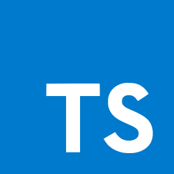

# TypeScript Learning Repository

This repository is designed to serve as your roadmap to learning TypeScript, documenting my journey from the basics to advanced concepts, and preparing you specifically for Angular development.
<div style="display: flex; justify-content: space-around;">
    
    
</div>


## Table of Contents

1. [Basics](./01_basics)

## Getting Started

1. Clone the repository:
    ```bash
    git clone https://github.com/enshikuku/typescript-learning.git
    cd typescript-learning
    ```

2. Install TypeScript:
    ```bash
    npm install -g typescript
    ```

3. Compile and run examples:
    ```bash
    tsc 01_basics/01_hello_world.ts
    node 01_basics/01_hello_world.js
    ```

## Directory Structure

- `01_basics/`: Learn the basics of TypeScript.
- `02_advanced/`: Dive into advanced TypeScript features.

## Contributions

Feel free to contribute by submitting a pull request or opening an issue.

## License

This project is licensed under the [MIT Licence](./LICENSE).
